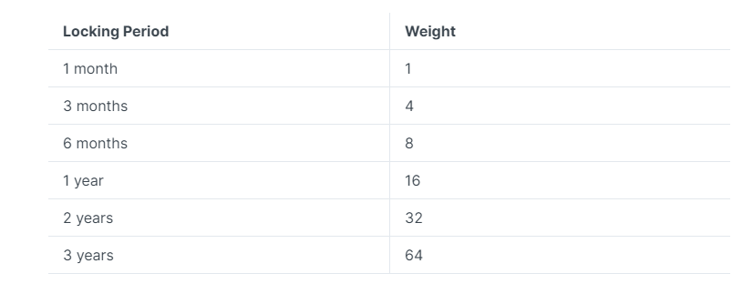

# Governance & Ecosystem fund

### Team's Profit

The Platform Fee and Royalty Fee are reserved to the team to sustain its operation, no less than 5% of the Team's profit will be sent to the Ecosystem fund.&#x20;

### Governance

The other taxes collected by TokShow will be funneled into a Treasury pool, which will be up to the TKST staker to decide （coming soon）

### Voting Power

By locking the staked TKST, users will get higher voting power（coming soon）

<figure><figcaption></figcaption></figure>
