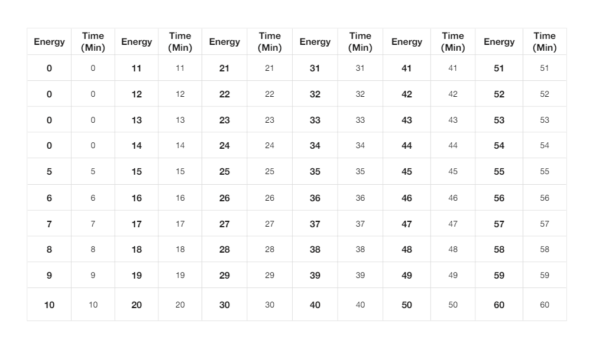

# Earn effective time

* The effective time of earn corresponds to the level and energy. For each level up, the energy increases by 1 point, and the corresponding effective time of earn increases by 1 minute.
* The lowest earn level is level 5, which corresponds to a valid earn time of 5 minutes, and the highest level is level 60, which corresponds to a valid earn time of 60 minutes.
* Those below level 5 have no energy and cannot earn tokens.
* After the user's energy is exhausted, the earn stops, and the user can earn after the energy is restored.
* Energy-effective time table.

<figure><figcaption></figcaption></figure>
