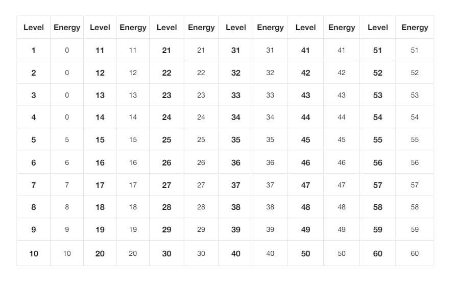

# Energy System

1. **Energy gain**

When the user level is higher than level 5, energy value will be obtained, and if the user level is lower than level 5, there will be no energy value.

2. **Energy use**

When the user starts earning, the energy value starts to be consumed, and when the energy value is exhausted, the earning stops.

3. **Energy recover**

The energy will not disappear if it is not used. According to UTC time, 25% of the total energy will be recovered every 6 hours, 4 times a day, UTC time (00:00, 06:00, 12:00, 18:00).

4. **Energy time limit**

The energy will not disappear if it is not used. But the maximum recovery is 100% every day, and it will be recalculated after 00:00 UTC time the next day.

5. **Level-Energy**

Below level 5, no energy.

There is a physical value starting from level 5, and each level increases by 1 energy point, with a minimum of 5 points and a maximum of 60 points.

6. **Level-Energy Table**

<figure><figcaption></figcaption></figure>
