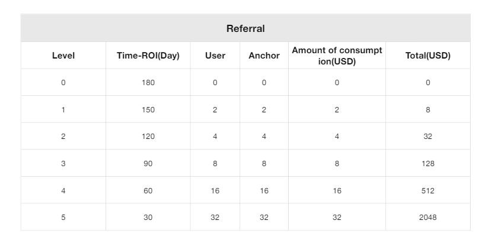

# Referral System

**Users can get rewards for referral new users, and the reward method is to shorten the length of ROI.**

<figure><figcaption>
Share
</figcaption></figure>

* Basic Time (ROI) = 180.
* Time (ROI), the more registered users are invited, the shorter the Time (ROI), the shortest is 30 days.
* For example, Level 1: Invite 2 users and 2 live hosts respectively, and spend more than 2 USD per person. Time (ROI) is reduced to 150 days.
* Time (ROI) can be as short as 30 days.
* The above data are theoretical values, which are calculated based on the fact that you log in every day and complete 100% of your daily mining earn.
